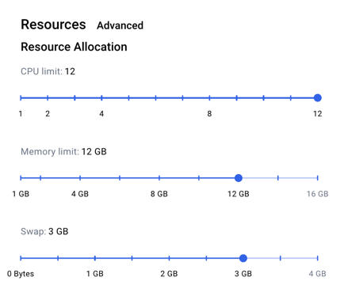

# Frequently Asked Questions
## Subnet Launch
### Common Issues 
- **Subnet blocks are not being mined**.

    1. First confirm that the Subnet nodes are able to communicate with each other through the network layer. Run the check peer script `generated/scripts/check-peers.sh` the number of peers should be one less than number of subnet nodes. For example, if there are 3 Subnet nodes in total, each node should have 2 peers.

    2. If the nodes are peering but still not mining, it could be a low memory issue. In Docker configs you can try to increase memory or swap. Then, in case of fresh Subnet, [delete data and start the nodes again](../install_guide/launch_subnet.md/#deleting-subnet). !

    3. Docker engine in Mac OS can be inconsistent after long-running or high-load. It could help to restart the machine and [hard reset the subnet](../install_guide/launch_subnet.md/#deleting-subnet) to get it running.

- **Subnet node does not boot with error log `Fatal: Error starting protocol stack: listen unix /work/xdcchain/XDC.ipc: bind: invalid argument`**

    This is due to the volume mount path being too long. The mounth path is your current directory (also can check with `pwd` command). Please move the `generated` folder to a shorter path and try again.

- **Docker image startup fails with `SIGKILL` or `Error code: 137` found in logs. (Issue found in Frontend image)**

    This error occurs because Docker ran Out Of Memory (OOM). You can increase the memory limit in [Docker settings](https://docs.docker.com/desktop/settings/mac/#:~:text=lower%20the%20number.-,Memory,-.%20By%20default%2C%20Docker)

  

### Troubleshooting Scripts

  - `generated/scripts/check-mining.sh`

  This will check your current block in Subnet

  - `generated/scripts/check-peers.sh`
  
  This will check the number of peers of your Subnet node

## Subnet Node Requirements

- **How many Subnet nodes should I have?**

  Even one node is enough to start the Subnet blockchain! However, for better decentralized security, 3+ nodes are recommended. At least 2/3 of all nodes must be online and honest to mine blocks.

## Development and Testing

- **For testing, should I checkpoint the Subnet to devnet or testnet?**

  It's recommended to use the testnet, as the devnet will be less stable due to frequent development changes.

## Managing Subnet Tokens

- **Where are all the Subnet tokens, and how do I use the Subnet?**

  In XDC-Subnet, all initial tokens are assigned to the Grandmaster wallet (check `keys.json`). You can transfer tokens to any wallet address. For easy transfers, refer to the [Faucet](../using_subnet.md/#faucet) documentation.

- **How can I manage Subnet tokens?**

  1. Use the [Subnet Faucet](../using_subnet.md/#faucet) to easily transfer Subnet tokens to your users.
  2. Use any Web3 wallet (such as Metamask or OKX wallet), add the Subnet RPC as a custom network then connect to the Subnet and transfer tokens to other addresses.

- **How can I easily give out Subnet tokens to my users?**

  A Faucet server script is provided for you to deploy under `generated/scripts/faucet-server.sh`. Anyone with access to the faucet page can request tokens. Please refer to the [faucet page](../using_subnet.md/#faucet) for more details.

## Security and Sensitive Files

- **Which files contain sensitive data and private keys?**

  The following files contain sensitive information and should be stored securely:

  - `common.env`
  - `contract_deploy.env`
  - `keys.json`
  - `subnet*.env`

## Configuration Changes

- **How do I change the Relayer Wallet/Parentchain Wallet?**

  You can update the `common.env` file to change the Relayer key. Refer to the [service configuration documentation](../upgrading_subnet.md/#updating-services-configs) for more details.

## Troubleshooting

- **What should I do if a function didn’t work or I encountered an unexpected bug?**

  For troubleshooting support, join our [Telegram Support Group](https://t.me/+jvkX6LaLEEthZWM1).  
  For suggestions or requests, you can also reach out via:

  - [XDC Forum](https://forum.xinfin.org/)
  - [GitHub Issues](https://github.com/XinFinOrg/XDC-Subnet/issues)
