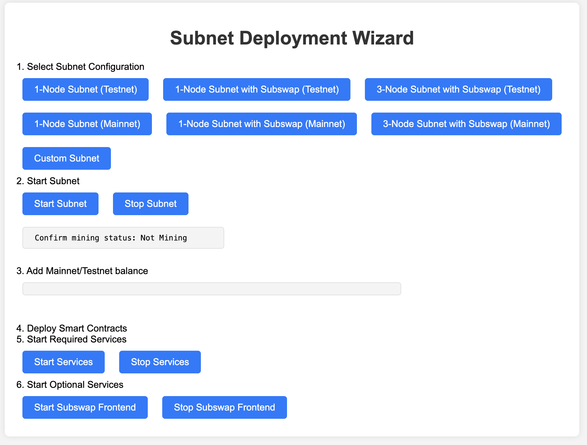
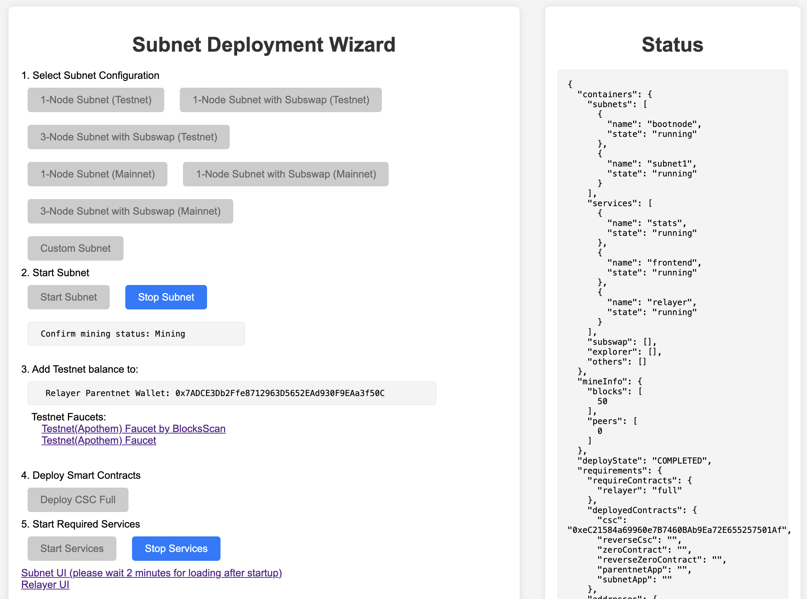

# Launch a Subnet

## Requirements
  - OS: Linux or Mac

  - docker and docker compose. For installation of docker compose please refer to: https://docs.docker.com/compose/install/linux/

  - Minimum Hardware Requirements:
    - Subnet Services:
        - CPU: 4 Core
        - Memory: 8 GB
        - Storage: 32 GB

    - Subnet Blockchain (per single Subnet node): 
        - CPU: 2 Core
        - Memory: 4 GB
        - Storage: 50 GB per year (takes up more space as blokchain grows)

  - Web3 wallet with funds. For testing we have testnet faucets:
    - https://faucet.apothem.network/ 
    - https://faucet.blocksscan.io/

## Video Walkthrough

<iframe width="768" height="432" src="https://www.youtube.com/embed/m-sPbMrB8ow" title="Setting Up Your Own XDC-Subnet Tutorial" frameborder="0" allow="accelerometer; autoplay; clipboard-write; encrypted-media; gyroscope; picture-in-picture; web-share" referrerpolicy="strict-origin-when-cross-origin" allowfullscreen></iframe>


## Generate Subnet Configs With Subnet Deployment Wizard UI

  1. Pull `start.sh` script from the generator Github repo and run. This will start a local webserver
  ```
  curl -O https://raw.githubusercontent.com/XinFinOrg/Subnet-Deployment/v2.0.0/container-manager/start.sh
  chmod +x start.sh
  ./start.sh
  ```
  
  2. Go to [http://localhost:5210/](http://localhost:5210) in your browser.
  <details>
  <summary>If you are running this on a remote server.</summary>
  <p>
    - if this is running on your server, first use ssh tunnel: <code>ssh -N -L localhost:5210:localhost:5210 USERNAME@IP_ADDRESS -i SERVER_KEY_FILE</code>
   <br> 
    - if you are using VSCode Remote Explorer, ssh tunnel will be available by default
  </p>
  </details>

  3. Select one of the pre-defined configs or customize your Subnet.
  

  4. Follow the UI to finish the deployment, you can also check the Status monitor of your containers:
    - Start Subnet nodes
    - Deploy cross-chain contracts
    - Start Subnet services
  

  5. Once successfully deployed, you can check out [UI usage guide](../using_subnet.md)
  
  <!-- 6. (Optional) if you deployed Subswap, check out the usage here: -->

<!-- ## Removing Subnet

### Shutdown Subnet
  Under `generated` directory
  ```
  docker compose --env-file docker-compose.env --profile services down 
  docker compose --env-file docker-compose.env --profile machine1 down
  ```

### Deleting Subnet 

  Remove `xdcchain*`, `bootnodes`, and `stats-service` directories
  Warning: this cannot be undone
  ``` 
  rm -rf xdcchain* bootnodes stats-service
  ``` -->
