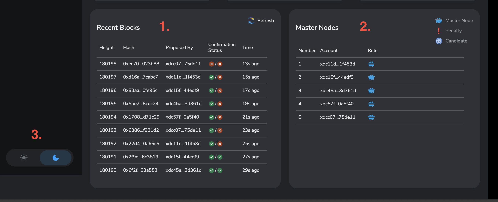
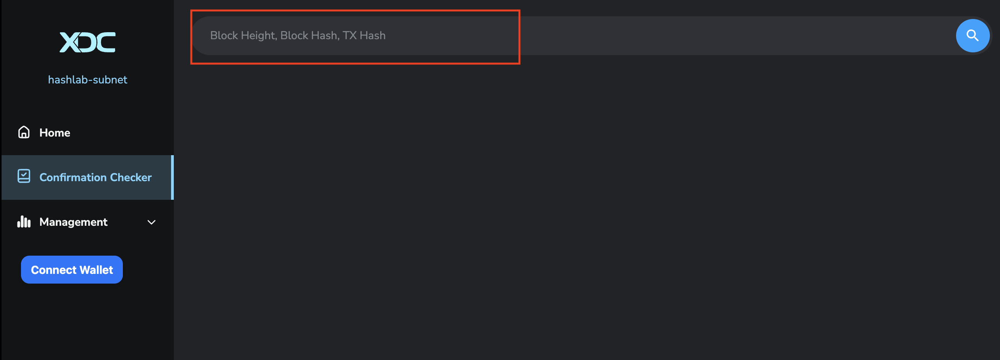
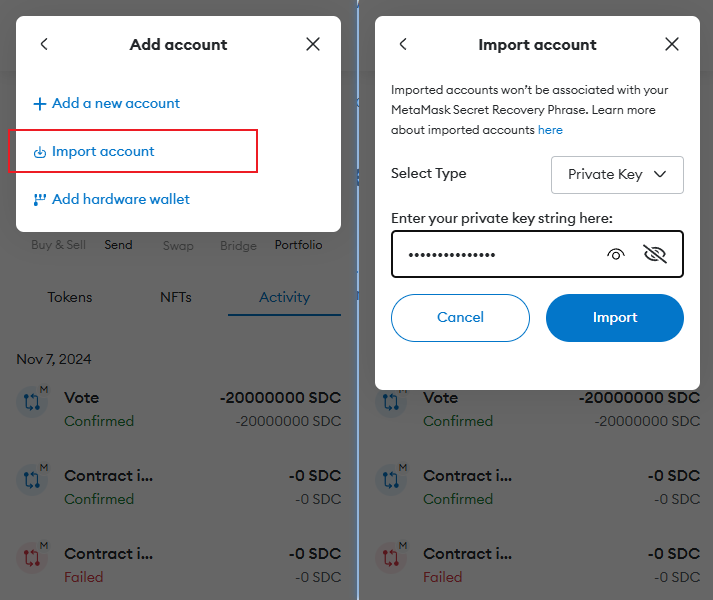
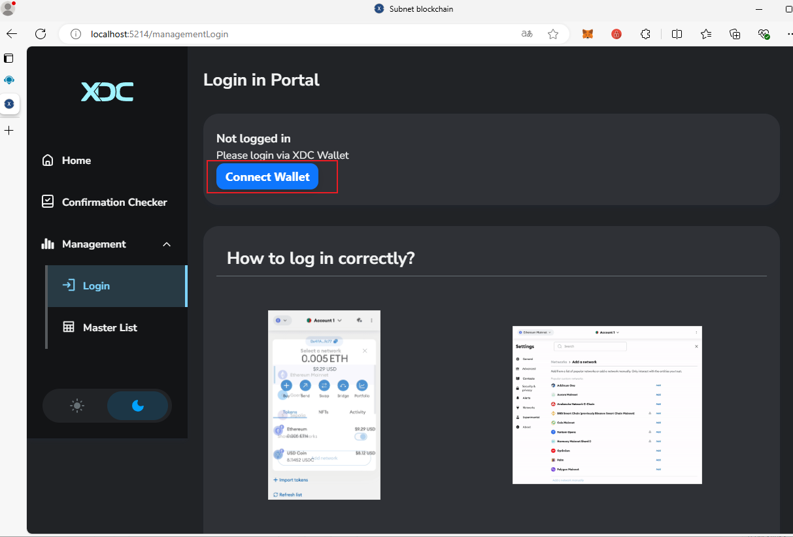
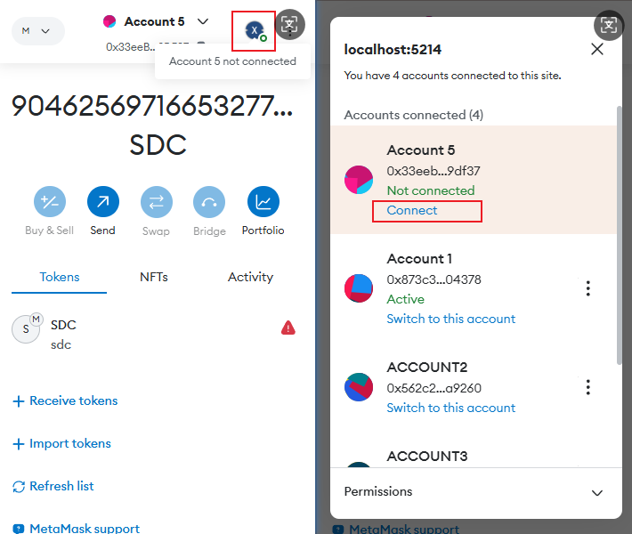
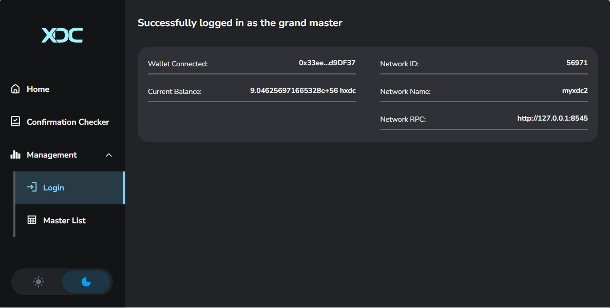
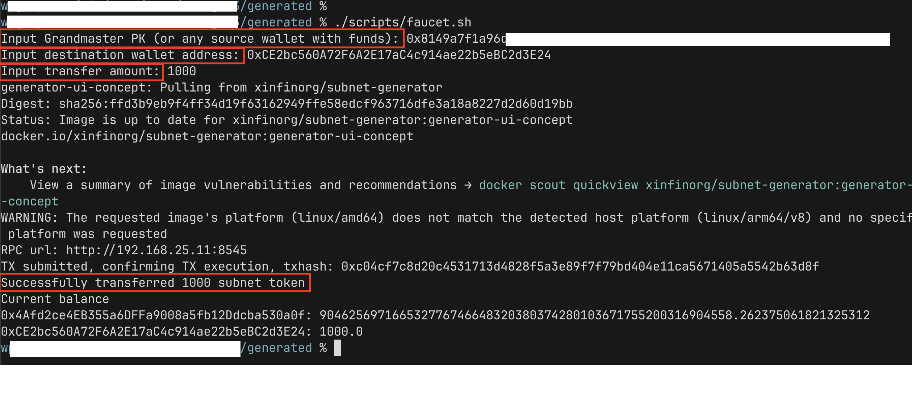

# UI Usage Guide
The guide for XDC Subnet user interface
## Homepage

Once subnet is successfully deployed. The homepage will show the following.


1. The Subnet blockchain state. You can see the current 'Not Confirmed' and 'Confirmed' blocks. 'Confirmed' or 'committed' blocks should be 3 blocks behind latest blocks.
2. The Subnet blockchain AS KNOWN by the Parentchain. The Relayer periodically calls the Checkpoint Smart Contract to update the Subnet status (default every 2 minutes).
3. The Network Info card shows the Subnet throughput state, by default Blocktime should be every 2 seconds. It also indicates the Parentchain network
4. The Relayer Info card shows the Relayer status. Which Checkpoint Smart Contract (CSC) it calls, Subnet blocks in the backlog, and the remaining wallet funds.
5. The Masternodes Info card shows the Subnet nodes status. By default, all Subnet nodes are Masternodes and all should be active.


In the lower half of the homepage there are more information as shown.




1. This card shows further details of subnet blocks, including their height, hash, proposer, and confirmation status. The left side of 'confirmation status' shows the block being committed in the Subnet chain and the right side shows the block hash being recorded in the Parent chain. 

2. This card shows a detailed view of the subnet nodes including their address. The status also differrentiates inactive nodes to 'penalty' or 'standby'

3. Additionally, you can select the UI theme (light or dark) by toggling this button.


## Confirmation Checker

After navigating with the left menu bar to the Confirmation Checker of the Subnet, this will be shown.



The input box accepts Block height, Block hash, and even TX hash. 

After your input, the search engine will traverse the chain and display the info accodingly. Below is an example of Block height search.


1. Confirmation status of the block (or the block that TX belongs to)
2. The block detailed information 
3. The Parentchain block where the Subnet block was recorded


Next is another example of a Block hash search.


1. Confirmation status of the block (or the block that TX belongs to)
2. The block detailed information 
3. As the Subnet block has not been checkpointed in the Parentchain, the UI is displaying height 0.


## Subnet Management

Subnet management is used for adding and removing Masternodes in the Subnet. To manage the subnet, you need to use the Grandmaster Account, as only the Grandmaster has the right to manage the Subnet.

You can find the Grandmaster Key in the `keys.json` file.

After making a modification with Subnet management, the change will take effect in the next epoch (900 blocks).

When adding a Masternode address in the management, the new Masternode server should also be started up and added to the network.

### 1. Log in to the Wallet and Connect to the Subnet

To manage the subnet, you need to use your **Grandmaster Account**. Find the **Grandmaster Key** in the `keys.json` file and import this account into your wallet.



1. Go to the correct tab and switch to the **Grandmaster Account**.
2. Click the `Connect Wallet` button.
   

3. Choose your wallet and allow the subnet network to be added. The wallet will automatically switch to this network, as shown below:
   

   If the wallet doesn’t switch to the subnet automatically, follow the instructions on the page to fill in the network details manually and connect to the subnet.

4. Connect the account and network.
   

You will see a confirmation page like this:



### 2. Node Operations

#### 2.1 Add candidate

1. Switch to the **Master List** Tab
2. Click the `Add a new master candidate` button to add the node as a master node. **Delegation amount** must be at least `10,000,000` Subnet tokens.
   

#### 2.2 Change node delegation

- In the list, select the node you want to change the delegation for, then click the `Promote` / `Demote` button and enter the new delegation amount.

  - If increasing the delegation, ensure the total delegation amount is over `10,000,000` Subnet tokens; otherwise, the transaction will fail.There is no extra benefit in delegating more than 10,000,000 tokens to an address
  - If decreasing the delegation, ensure the remaining amount is still at least `10,000,000` Subnet tokens; otherwise, the transaction will fail.

    

#### 2.3 Remove a node

1. In the **Master List** Tab, select the node you want to remove, and click the `Remove` button.
2. After removal, the node’s delegated XDC will be reset to zero, and the node information will be removed from the list after one epoch.
   


## Faucet

In Subnets, all native tokens are initially assigned to the Grandmaster Wallet. To allow users to use the Subnet, we have to distribute the tokens out of the Grandmaster. We have provided convenient scripts for you to easily share Subnet tokens to your users.

### One-time Transfer

Under `generated` directory run the Faucet script. 

```
./scripts/faucet.sh
```

The script will ask for your source wallet private key. You can use the Grandmaster Wallet(check `keys.json` file for the private key). 
Then input the destination wallet and the transfer amount.



### Faucet Server

Under `generated` directory run the Faucet server script.

```
./scripts/faucet-server.sh
```

The script will ask for your source wallet private key. you can use the Grandmaster Wallet(check `keys.json` for the private key).
By default, the server is hosted on port `5211` of your machine. Then, on your browser, visit the url: `http://127.0.0.1:5211`


Input your destination wallet or feel free to generate a random wallet via Address Generator.


Submit and wait for confirmation.


You can host this on any server and allow users to make token requests by themselves.

### Transfer Subnet Funds Without Faucet

The Faucet is not neccessary needed for funds transfer, most Ethereum compatible web3 wallet will also work. 

First import a new wallet with the Grandmaster private key. Then add a custom network pointing to your Subnet RPC URL. Finally, use the web3 wallet for tokens transfer.


### Faucet Source Code

Please feel free to check the below repositories for the Subnet Faucet source code.

https://github.com/XinFinOrg/XinFin-Node/tree/master/subnet/deployment-generator/scripts

https://github.com/XinFinOrg/XinFin-Node/tree/master/subnet/deployment-generator/src/faucet.js


## Blockchain Explorer

You may optionally use an external blocks explorer if you require verbose browsing such as block detail, accounts browsing, contracts browsing. We can recommend [Chainlens-free](https://github.com/web3labs/chainlens-free/tree/master/docker-compose) as one of the solution. Please follow the instructions as the previous link. You only need to pass one of the Subnet's RPC as a variable in the `docker-compose` command, which will most likely be `NODE_ENDPOINT=http://localhost:8545` or `NODE_ENDPOINT=http://<MAIN_IP>:8545`.
